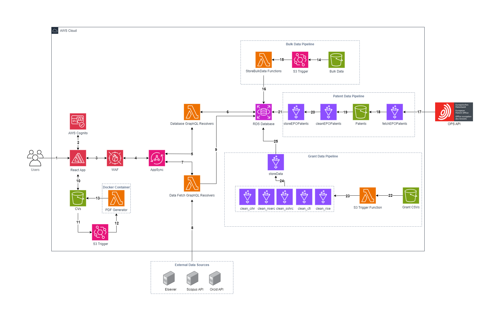

# Faculty CV

This prototype application centralizes academic outputs and automates the creation of standardized CVs. The system streamlines data collection from various internal and external sources, reducing the administrative burden on faculty and staff. By formatting data consistently and allowing assistants to access faculty profiles, it enhances operational efficiency.

| Index                                               | Description                                             |
| :-------------------------------------------------- | :------------------------------------------------------ |
| [High Level Architecture](#High-Level-Architecture) | High level overview illustrating component interactions |
| [Deployment](#Deployment-Guide)                     | How to deploy the project                               |
| [User Guide](#User-Guide)                           | The working solution                                    |
| [API Guide](#API-Guide)                           | A guide to the GraphQL API                                    |
| [Directories](#Directories)         | General project directory structure             |
| [Changelog](#Changelog)                             | Any changes post publish                                |
| [Credits](#Credits)                                 | Meet the team behind the solution                       |
| [License](#License)                                 | License details                                         |

# High Level Architecture

The following architecture diagram illustrates the various AWS components utliized to deliver the solution. For an in-depth explanation of the frontend and backend stacks, refer to the [Architecture Deep Dive](docs/ArchitectureDeepDive.md).



# Deployment Guide

To deploy this solution, please follow the steps laid out in the [Deployment Guide](docs/DeploymentGuide.md)

# User Guide

For instructions on how to navigate the web app interface, refer to the [Web App User Guide](docs/UserGuide.md).

# API Guide

For details on the queries and mutations made for this GraphQL API, refer to the [API Guide](docs/APIGuide.md).

# Directories

```text
.
├── cdk/
│   ├── bin
|   ├── glue
|   ├── graphql
|   ├── lambda
|   ├── layers
|   ├── lib
├── docs
├── frontend/
│   ├── public
│   ├── src/
│   │   ├── Components
│   │   ├── graphql
│   │   ├── utils
│   │   ├── Views
└── README.md
```
1. `/cdk`: Contains the deployment code for the app's AWS infrastructure
    - `/bin`: Contains the instantiation of CDK stack
    - `/glue/scripts`: Contains scripts for glue jobs
    - `/graphql`: Contains the GraphQL schema
    - `/lambda`: Contains lambda functions
    - `/layers`: Contains the required layers for lambda functions
    - `/lib`: Contains the deployment code for all infrastructure stacks
2. `/docs`: Contains documentation for the application
3. `/frontend`: Contains the user interface of the application
    - `/public`: Contains public assets used in the application
    - `/src/components`: Contains React components used in the application
    - `/src/graphql`: Contains queries, mutations and GraphQL helper functions 
    - `/src/utils`: Contains helper functions used in the application
    - `/src/Views`: Contains files for app routing
  
# Changelog
N/A

# Credits

This application was architected and developed by [Abhi Verma](https://www.linkedin.com/in/abhi-verma13/), [Aayush Behl](https://www.linkedin.com/in/aayushbehl/) and [Alethea Kramer](https://www.linkedin.com/in/alethea-kramer/), with project assistance by Anjali Bentley and Victoria Li. A special thanks to the UBC Cloud Innovation Centre Technical and Project Management teams for their guidance and support.
# License

This project is distributed under the [MIT License](LICENSE).
