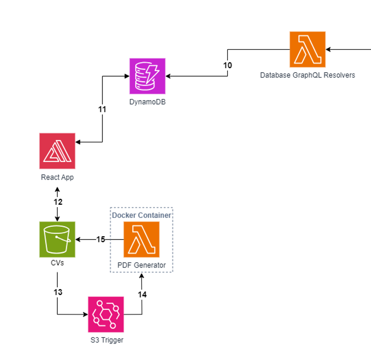
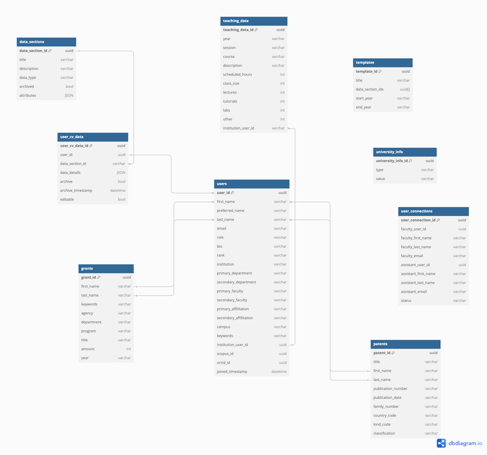

# Architecture Deep Dive
This document provides a more in-depth explanation of the system's architecture and operation.

## Table of Contents
<!-- no toc -->
- [Architecture Diagram](#architecture-diagram)
- [Front End Flow (1-4)](#front-end-flow-1-4)
- [User Data Retrieval Flow (5-9)](#user-data-retrieval-flow-5-9)
- [CV Generation Flow (10-15)](#cv-generation-flow-10-15)
- [Bulk Data Pipeline (16-18)](#bulk-data-pipeline-16-18)
- [Patent Data Pipeline (19-23)](#patent-data-pipeline-19-23)
- [Grant Data Pipeline (24-27)](#grant-data-pipeline-24-27)
- [Database Schema](#database-schema)

## Architecture Diagram

The architecture diagram exported as XML file from draw.io can be found [here](../docs/architecture/FacultyCV_architecture.drawio.xml).

## Front End Flow (1-4)

1. Users navigate to the application in their web browser.
2. Users connect to the webpage, where access to AWS resources is done through authentication using AWS Cognito.
3. All queries are first sent to AWS WAF. This helps prevent malicious users from getting data or breaking the website with DDOS attacks.
4. All queries approved by AWS Web Application Firewall (WAF) are passed to AppSync
  

## User Data Retrieval Flow (5-9)

5. AWS AppSync triggers a Lambda resolver and passes the correct variables needed to get the required data  
6. The Lambda resolver connects to the PostgreSQL database and gets the data requested by AppSync  
7. AWS AppSync triggers a Lambda resolver to fetch profiles and publications from external sources. The user then chooses which profiles/publications to add from a list of results.  
8. The Lambda resolver grabs profiles/publications from various data sources based on name and institution.  
9. After confirming the profiles/publications belong to them, the data is stored in RDS.  

## CV Generation Flow (10-15)

#### Steps 10-15 are explored in more detail as part of the [CV Generation Deep Dive](/docs/CVGenerationDeepDive.md)

10. The GraphQL resolvers that make updates to the the data that will be contained on a CV (e.g. updateUser, updateUserCVData) make logs to the DynamoDB table which indicate when the last update was made to the data corresponding to a particular user and CV template.
11. The React app fetches the timestamp of the last update to data corresponding to a user and template.  
12. If the last update timestamp is older than the CV on the S3 bucket, then the CV on the S3 bucket is up to date and a Lambda function fetches a pre-signed URL to the CV to allow download on the frontend. Otherwise, it needs to be regenerated and the React application generates a latex file for the CV and uploads it to the S3 bucket.
13. The S3 bucket is configured to trigger a CV generator Lambda function any time a .tex file is uploaded to it.
14. The S3 trigger causes the PDF Generator Lambda function to execute. This function runs on a Docker container which uses the pdflatex library to convert the recently uploaded .tex file (in Step 13) to a .pdf file.
15. The PDF file is uploaded to the S3 bucket and is stored in the same folder as the .tex file.

## Bulk Data Pipeline (16-18)

#### Steps 16-18 are explored in more detail as part of the [Bulk Data Pipeline Deep Dive](/docs/BulkDataPipelineDeepDive.md)

16. Comma separated values (CSV) files (data_sections.csv, institution_data.csv, university_info.csv and teaching_data.csv) must be uploaded to the bulk data S3 bucket.
17. Uploading the CSV files to the S3 bucket triggers a lambda function.
18. The Lambda function stores the data from these CSV files in the PostgreSQL database.

## Patent Data Pipeline (19-23)

#### Steps 19-23 are explored in more detail as part of the [Patent Data Pipeline Deep Dive](/docs/PatentDataPipelineDeepDive.md)

19.  This step fetches raw data from the API. This is achieved by making a GET request to the specific API endpoint that returns bibliographic data for patent publications. The query will retrieve all patent publications from the year 2001 up to the date on which the patent pipeline is invoked. Patent publication data includes both patent application documents (kind code A1, A2) and patent documents (kind code B1, B2, C) for both Canada (country code CA) and the United States (country code US).
20. This glue job fetches the patents and stores them inside an S3 bucket as a CSV.
21. The glue job will fetch the raw data from the S3 bucket to clean the data.
22.  This glue job cleans the patent data, including eliminating special characters, trimming white spaces, and modifying the date format. Additionally, inventors' names will be capitalized and split into first and last names.
23. After each patent entry is cleaned, this glue job will insert the processed patent data into the RDS database under the patents table.

## Grant Data Pipeline (24-27)

#### Steps 24-27 are explored in more detail as part of the [Grant Data Pipeline Deep Dive](/docs/GrantDataPipelineDeepDive.md)

24. When files are uploaded to the S3 bucket, an Object upload event notification will be sent out to the Lambda function. The Function will filter the event received and in turns will invoke the correct Glue job. Some Glue jobs (clean-...-pythonshell) will create temporary subfolders and files in the same bucket, and the bucket will in turns create corresponding event notification to the Lambda function again, and again to invoke Glue jobs downstream of the pipeline, until the grant data is put in the PostgreSQL database.
25. Raw grant data (currently CIHR, NSERC, SSHRC, CFI and internal UBC data from RISE) are fetched from an Amazon S3 bucket in the form of comma separated values (CSV) files. The datasets are cleaned which involves standardizing the researcher names, modifying date encoding format, remove special characters. The researcher names are separated into First Name and Last Name for name matching later on. The results are stored in a temporary folder called clean in the same S3 bucket.
26. When csv files are uploaded to the clean folder, a bucket event notification will be issued to the handling Lambda function to invoke the store-data-pythonshell. 
27. This job will store the data in a table called grants int the PostgreSQL database

## Database Schema
The schema below illustrates the structure of each table and how they are related to each other:

**users**: Stores user information for faculty, assistants, admins, and department admins.
___
**data_sections**: Stores the section information including the attributes in a JSON object.
___
**user_cv_data**: Stores user CV data as a JSON object in data_details and other data information.
___
**teaching_data**: Stores TTPS data from csv uploaded to S3.
___
**grants**: Stores grant data from multiple external sources as well as the internal RISe data.
___
**patents**: Stores patent data fetched from the European Patent Office (EPO).
___
**university_info**: Stores university info in the following format: Faculty (type) and Medicine (value). This information is retrieved from a csv uploaded to S3.
___
**templates**: Stores templates for CVs.
___
**user_connections**: Stores the connections between Faculty and Assistants.
