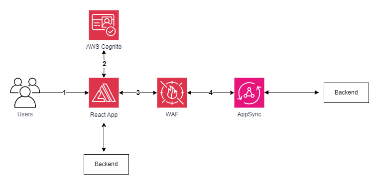
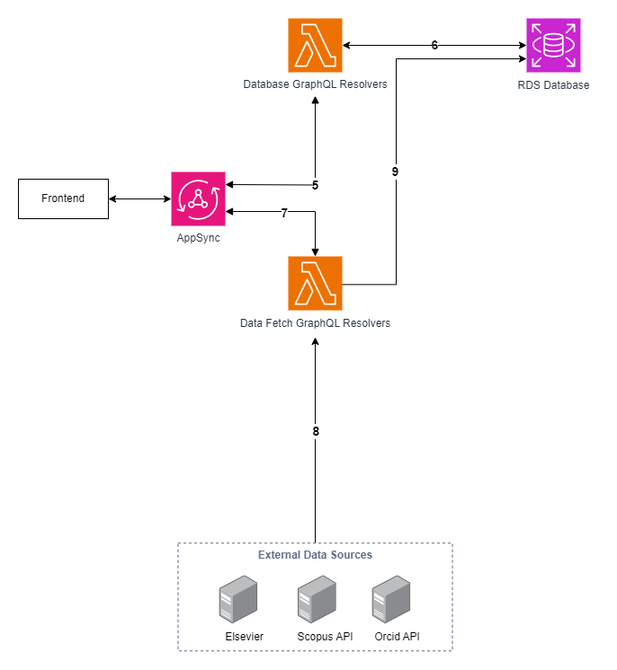
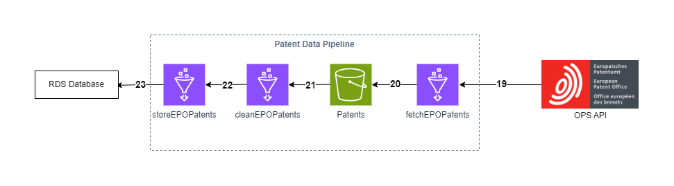
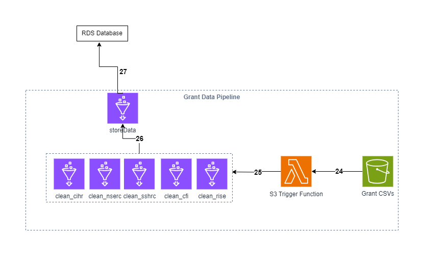
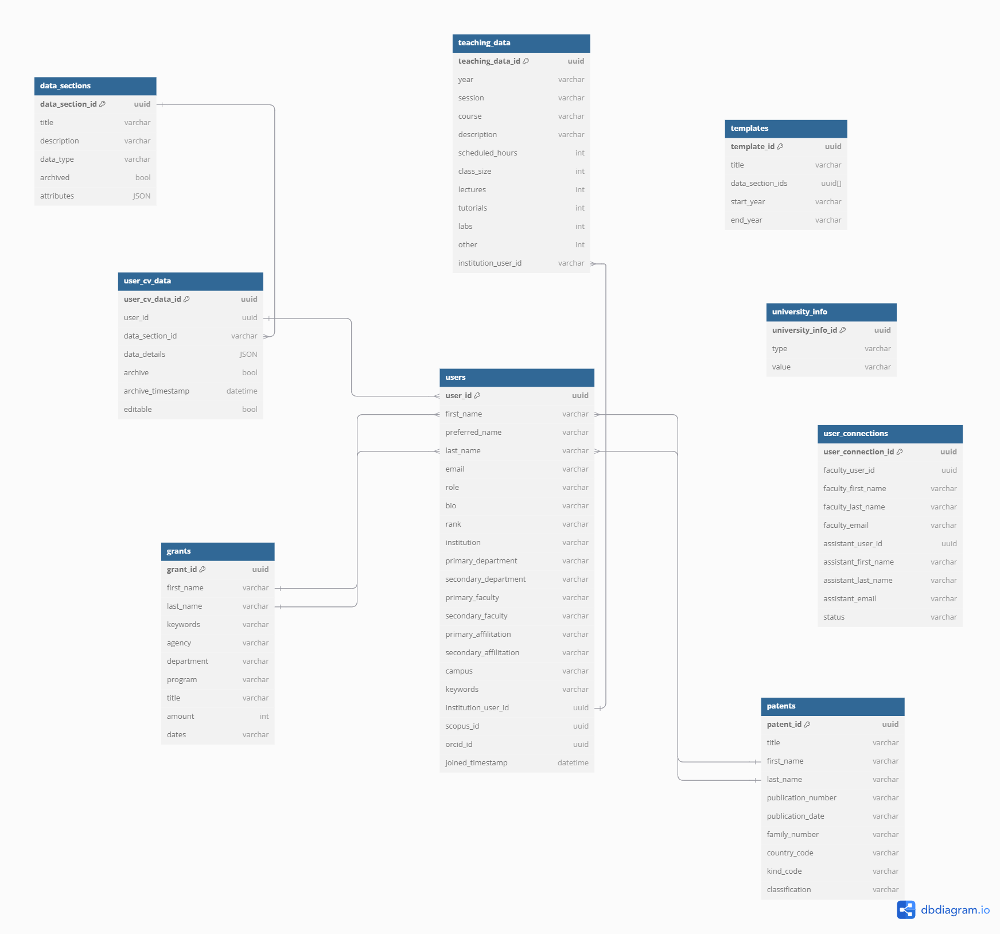

# Architecture Deep Dive
This document provides a more in-depth explanation of the system's architecture and operation.

## Table of Contents
<!-- no toc -->
- [Architecture Diagram](#architecture-diagram)
- [Front End Flow (1-4)](#front-end-flow-1-4)
- [User Data Retrieval Flow (5-9)](#user-data-retrieval-flow-5-9)
- [CV Generation Flow (10-13)](#cv-generation-flow-10-13)
- [Bulk Data Pipeline (14-16)](#bulk-data-pipeline-14-16)
- [Patent Data Pipeline (17-21)](#patent-data-pipeline-17-21)
- [Grant Data Pipeline (22-25)](#grant-data-pipeline-21-25)
- [Database Schema](#database-schema)

## Architecture Diagram

The architecture diagram exported as XML file from draw.io can be found [here](../docs/architecture/FacultyCV_architecture.drawio.xml).

## Front End Flow (1-4)

1. Users navigate to the application in their web browser.
2. Users connect to the webpage, where access to AWS resources is done through authentication using AWS Cognito.
3. All queries are first sent to AWS WAF. This helps prevent malicious users from getting data or breaking the website with DDOS attacks.
4. All queries approved by AWS Web Application Firewall (WAF) are passed to AppSync
  

## User Data Retrieval Flow (5-9)

5. AWS AppSync triggers a Lambda resolver and passes the correct variables needed to get the required data  
6. The Lambda resolver connects to the RDS database and gets the data requested by AppSync  
7. AWS AppSync triggers a Lambda resolver to fetch profiles and publications from external sources. The user then chooses which profiles/publications to add from a list of results.  
8. The Lambda resolver grabs profiles/publications from various data sources based on name and institution.  
9. After confirming the profiles/publications belong to them, the data is stored in RDS.  

## CV Generation Flow (10-13)

## Bulk Data Pipeline (14-16)

14. Comma separated values (CSV) files (data_sections.csv, institution_data.csv, university_info.csv and teaching_data.csv) must be uploaded to the bulk data S3 bucket.
15. Uploading the CSV files to the S3 bucket triggers a lambda function.
16. The Lambda function stores the data from these CSV files in the RDS database.

## Patent Data Pipeline (17-21)

#### Step 17-21 are explored in more detail as part of the [Patent Data Pipeline Deep Dive](/docs/PatentDataPipelineDeepDive.md)

17.  This step fetches raw data from the API. This is achieved by making a GET request to the specific API endpoint that returns bibliographic data for patent publications. The query will retrieve all patent publications from the year 2001 up to the date on which the patent pipeline is invoked. Patent publication data includes both patent application documents (kind code A1, A2) and patent documents (kind code B1, B2, C) for both Canada (country code CA) and the United States (country code US).
18. This glue job fetches the patents and stores them inside an S3 bucket as a CSV.
19. This glue job will get the raw data from S3 and perform the necessary cleaning steps. Data processing steps include: eliminating special characters, trimming white spaces, and modifying the date format. Additionally, inventors' names will be capitalized and split into first and last names.
20. After each patent entry is cleaned, this glue job will insert the processed patent data into the RDS database under the patents table.

## Grant Data Pipeline (22-25)

#### Step 22-25 are explored in more detail as part of the [Grant Data Pipeline Deep Dive](/docs/GrantDataPipelineDeepDive.md)

22. When files are uploaded to the S3 bucket, an Object upload event notification will be sent out to the Lambda function. The Function will filter the event received and in turns will invoke the correct Glue job. Some Glue jobs (clean-...-pythonshell) will create temporary subfolders and files in the same bucket, and the bucket will in turns create corresponding event notification to the Lambda function again, and again to invoke Glue jobs downstream of the pipeline, until the grant data is put in the RDS
23. Raw grant data (currently CIHR, NSERC, SSHRC, CFI and internal UBC data from RISE) are fetched from an Amazon S3 bucket in the form of comma separated values (CSV) files. The datasets are cleaned which involves standardizing the researcher names, modifying date encoding format, remove special characters. The researcher names are separated into First Name and Last Name for name matching later on. The results are stored in a temporary folder called clean in the same S3 bucket.
24. When csv files are uploaded to the clean folder, a bucket event notification will be issued to the handling Lambda function to invoke the store-data-pythonshell. 
25. This job will store the data in a table called grants int the RDS database

## Database Schema
The schema below illustrates the structure of each table and how they are related to each other:
