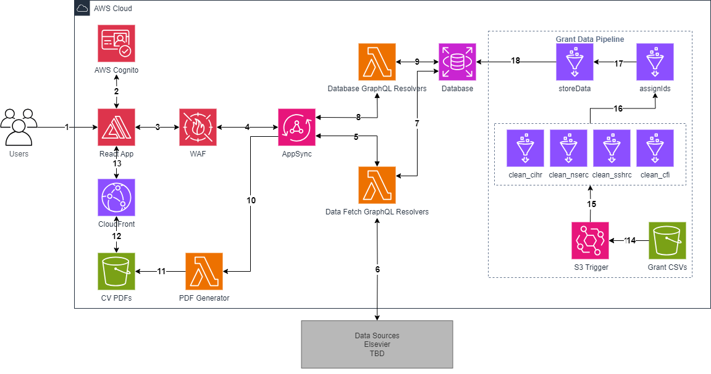

# Architecture Deep Dive
This document provides a more in-depth explanation of the system's architecture and operation.

## Table of Contents
<!-- no toc -->
- [Architecture Diagram](#architecture-diagram)
- [Front End Flow (1-4)](#front-end-flow-1-4)
- [User Data Retrieval Flow (5-9)](#user-data-retrieval-flow-5-9)
- [CV Generation Flow (10-13)](#cv-generation-flow-10-13)
- [Bulk Data Pipeline (14-16)](#bulk-data-pipeline-14-16)
- [Patent Data Pipeline (17-21)](#patent-data-pipeline-17-21)
- [Grant Data Pipeline (21-25)](#grant-data-pipeline-21-25)
- [Database Schema](#database-schema)

## Architecture Diagram

The architecture diagram exported as XML file from draw.io can be found [here](../docs/architecture/FacultyCV_architecture.drawio.xml).

## Front End Flow (1-4)

1. Users navigate to the application in their web browser.
2. Users connect to the webpage, where access to AWS resources is done through authentication using AWS Cognito.
3. All queries are first sent to AWS WAF. This helps prevent malicious users from getting data or breaking the website with DDOS attacks.
4. All queries approved by AWS Web Application Firewall (WAF) are passed to AppSync
   
## User Data Retrieval Flow (5-9)

## CV Generation Flow (10-13)

## Bulk Data Pipeline (14-16)

## Patent Data Pipeline (17-21)

## Grant Data Pipeline (21-25)

## Database Schema
The schema below illustrates the structure of each table and how they are related to each other.
