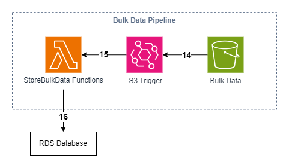
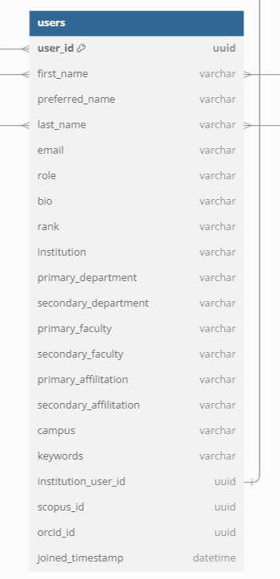
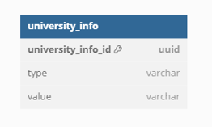
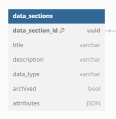
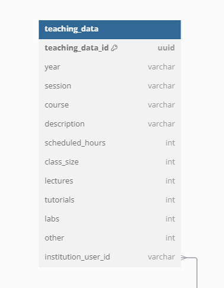

# Bulk Data Pipeline Deep Dive

The goal of the Bulk Data Pipeline is to initially populate the database with users, university information, data sections and teaching data from the following 4 Comma-Separated-Value (CSV) files:

1. institution_data.csv
2. university_info.csv
3. data_sections.csv
4. teaching_data.csv

***


For the pipeline to run, currently a total of 4 CSV files need to be uploaded to the designated S3 bucket. Detailed on how to perform this part is outlined in [Step 4 in the Deployment Guide](DeploymentGuide.md#step-6-upload-data-to-s3-for-the-grant-data-pipeline). Assuming the uploading process is done correctly, the entire pipeline will automatically run from start to end without needing further user intervention (unless there is an error). These are the [sample csv files](../docs/sample_data/) you can refer to in order to make sure they follow the same format.

This document will show exactly how that is achieved.

## 1. S3 Object Upload Event Notification

`user_data` folder structure:

```text
user_data/
├── institution_data.csv
├── university_info.csv
├── data_sections.csv
└── teaching_data.csv
```

Amazon S3 Bucket has a functionality called Event Notification. Whenever a user Uploads/Delete/Copy a file inside a Bucket, they can set up an event notification that lets the bucket communicate with other cloud event services (SQS, SNS, Lambda). For this pipeline, S3 was set up a notification specifically for s3:ObjectCreated:PUT event, so that whenever the user uploaded the data, S3 will notify a Lambda function via Event Notification.

## 2. Why do the files follow a naming convention?

Lambda is the event receiver which stores the data from each CSV file into our database. There are multiple functions that will always listen to uploading events originating from the **user_data** folder. The function that is called depends on which file is uploaded which is why the naming convention is very important. For example the Lambda function storeBulkUsers is called when the file institution_data.csv is uploaded to the S3 bucket which stores all the preloaded bulk users into the database. 

## 3. Store data


Each CSV file has data that is inserted into a different table in our PostgreSQL database.

### 3.1 institution_data.csv

The institution_data.csv contains data for bulk loading users into our application. Users will be matched to this data if it already exists based on their emails when they sign up. This way they will already have the information associated with their profile filled out. This data is inserted into the `users` table.



### 3.11 `users` table

| Column Name          | Description                                       | Source   |
|----------------------|---------------------------------------------------|----------|
| user_id              | The unique ID associated with each user           | Generated internally by the PostgreSQL Database Engine |
| first_name           | The user's first name                             | CSV file |
| preferred_name       | The name the user prefers to be called            | CSV file |
| last_name            | The user's last name                              | CSV file |
| email                | The user's email address                          | CSV file |
| role                 | The role of the user within the organization      | CSV file |
| bio                  | A brief biography of the user                     | CSV file |
| rank                 | The rank of the user within the organization      | CSV file |
| institution          | The institution with which the user is affiliated | CSV file |
| primary_department   | The user's primary department                     | CSV file |
| secondary_department | The user's secondary department                   | CSV file |
| primary_faculty      | The user's primary faculty                        | CSV file |
| secondary_faculty    | The user's secondary faculty                      | CSV file |
| primary_affiliation  | The user's primary affiliation                    | CSV file |
| secondary_affiliation| The user's secondary affiliation                  | CSV file |
| campus               | The campus the user is located at                 | CSV file |
| keywords             | Keywords associated with the user                 | CSV file |
| institution_user_id  | Unique ID for the user within the institution     | CSV file |
| scopus_id            | Unique ID for the user within Scopus              | CSV file |
| orcid_id             | The user's ORCID ID                               | CSV file |
| joined_timestamp     | The datetime when the user was added              | CSV file |


### 3.2 university_info.csv

The university_info.csv contains data about the institution such as faculties, departments, campuses and affiliations. In this csv the `type` column would be what type of data it is such as "Faculty" and the `value` column contains the actual data such as "Medicine". This data is used for options that Faculty can select on their profiles and is inserted into the `university_info` table.



### 3.21 `university_info` table

| Column Name       | Description                                       | Source   |
|-------------------|---------------------------------------------------|----------|
| university_info_id| The unique ID associated with each university info| Generated internally by the PostgreSQL Database Engine |
| type              | The type of information                           | CSV file |
| value             | The value corresponding to the type                | CSV file |


### 3.3 data_sections.csv

The data_sections.csv contains data about the sections that show up on Faculty CVs. The attributes of a section are stored as a JSON object to make it easier to insert new attributes to an existing section. This data is used to generate the Faculty CVs and is inserted into the `data_sections` table.



### 3.31 `data_sections` table

| Column Name      | Description                                   | Source   |
|------------------|-----------------------------------------------|----------|
| data_section_id  | The unique ID associated with each data section | Generated internally by the PostgreSQL Database Engine |
| title            | The title of the data section                  | CSV file |
| description      | A description of what the data section contains | CSV file |
| data_type        | The type of data stored in the section          | CSV file |
| archived         | Whether the data section is archived or not  | CSV file |
| attributes       | JSON object containing attributes of the data section    | CSV file |


### 3.4 teaching_data.csv

The teaching_data.csv contains data about courses taught by Faculty members and will eventually end up in the Courses Taught section of a CV. The data will be matched to users based on the institution_user_id. This CSV is made from UBC's internal TTPS data and is inserted into the `teaching_data` table.



### 3.41 `teaching_data` table

| Column Name         | Description                                      | Source    |
| ------------------- | ------------------------------------------------ | --------- |
| teaching_data_id    | the unique ID associated with each teaching record | Generated internally by the PostgreSQL Database Engine |
| year                | the fiscal year                                   | CSV file |
| session             | the academic session                              | CSV file |
| course              | the course code                                   | CSV file |
| description         | the course description                            | CSV file |
| scheduled_hours     | the number of scheduled hours for the course      | CSV file |
| class_size          | the size of the class                             | CSV file |
| lectures            | the number of lectures                            | CSV file |
| tutorials           | the number of tutorials                           | CSV file |
| labs                | the number of lab sessions                        | CSV file |
| other               | other teaching activities                         | CSV file |
| institution_user_id | the unique ID of the institution user             | CSV file |
